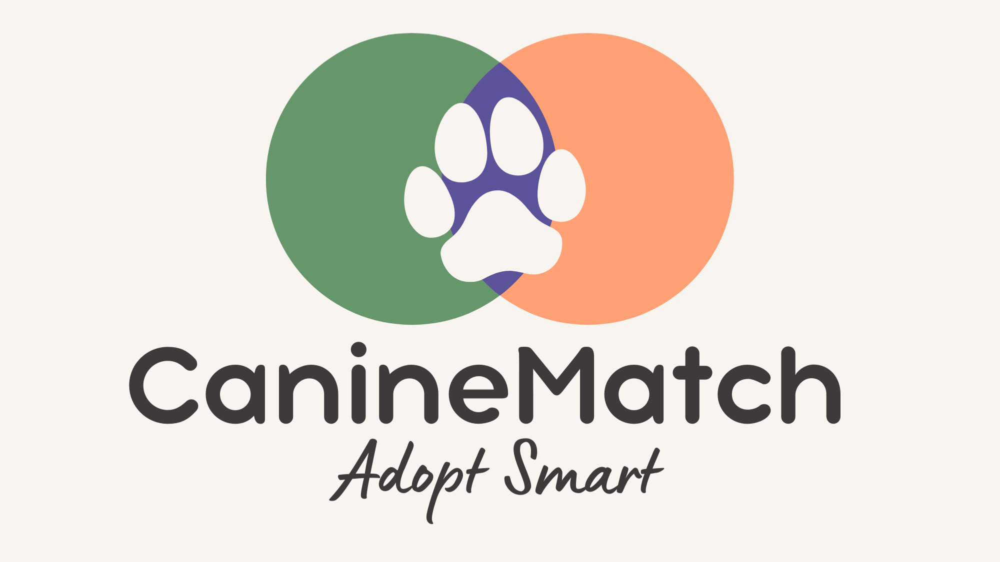

# CanineMatch

CanineMatch is a web application that pairs prospective dog owners with shelter dogs using quantitative compatibility scoring. It filters available dogs based on physical preferences and calculates a match percentage using cosine similarity against behavioral trait profiles.

## Tech Stack
* **Backend:** Python, FastAPI, Pandas, NumPy, Scikit-Learn
* **Frontend:** HTML5, CSS3, Vanilla JavaScript

## Data Sources
This project processes real-world shelter data and cross-references it with standardized breed behavioral benchmarks.
* [Austin Animal Center Outcomes (10/01/2013 to 05/05/2025)](https://catalog.data.gov/dataset/austin-animal-center-outcomes-10-01-2013-to-05-05-2025)
* [AKC Breed Data Repository](https://github.com/tmfilho/akcdata/tree/master)
* Project context and inspiration via [Animal Hack](https://animalhack.org/)

## How It Works
1. **Filter**: Dogs are filtered by size, age, and sex preferences.
2. **Score**: User trait sliders (energy, noise, maintenance, apartment suitability, kid-friendliness, independence, trainability, space requirement, exercise intensity) are compared against each dog's breed-derived trait vector using cosine similarity.
3. **Rank**: Dogs are sorted by match score (0–100%) and returned to the frontend for browsing.

## Local Setup

### Backend
1. Navigate to the project directory.
2. Install the required Python dependencies:
   ```bash
   pip install fastapi uvicorn pandas numpy scikit-learn pydantic
   ```
3. Make sure the processed dataset exists at:
   ```
   data/processed/shelter_dogs_database.csv
   ```
4. Run the API server:
   ```bash
   uvicorn backend.main:app --reload
   ```
5. The API will be available at `http://127.0.0.1:8000`.

### Frontend
1. Open `frontend/index.html` in your browser (or serve the `frontend` folder with a simple static server).
2. Make sure the backend is running at `http://127.0.0.1:8000` — the frontend calls this address directly in `script.js`.
3. Adjust your size, age, and sex preferences, set the trait sliders, and click **Find Matches**.

## Notes
* CORS is currently open to all origins for local development — restrict `allow_origins` before deploying.
* The "Browse Shelter Portal" link currently points to a generic shelter adoption page rather than a per-dog listing.
